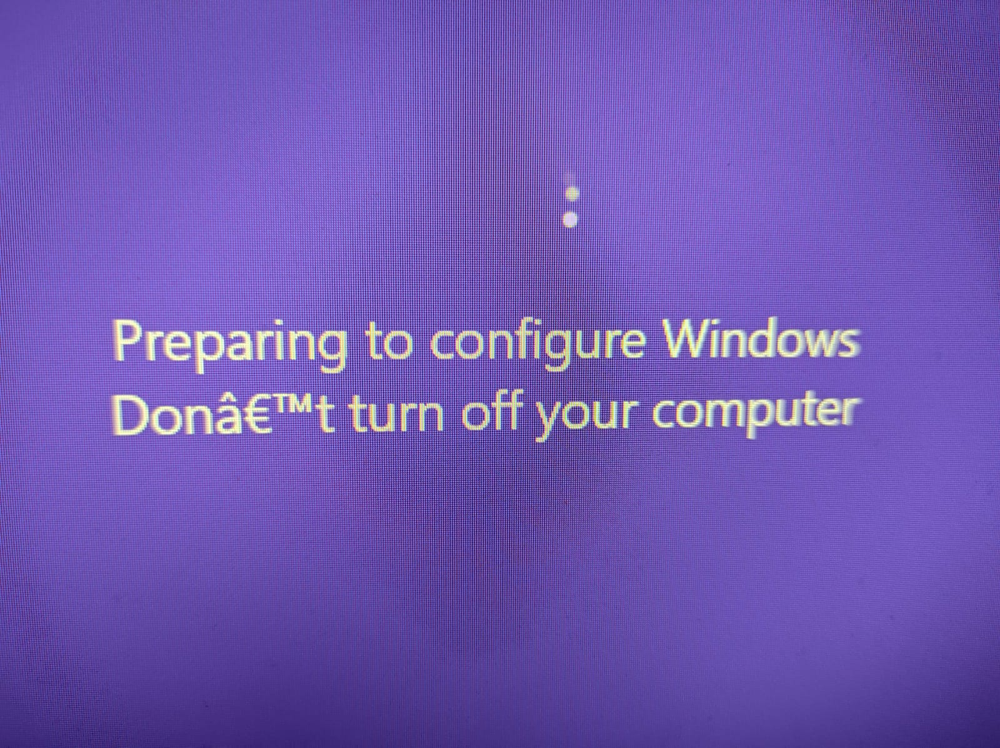

# I Have a Hammer 👋

## Hello Hammer 🔨

Scott Spence • <span
style={{ color: '#663399' }}>MMT_TechMeetup</span>

<small>Feb 2021</small>

---

# Scott Spence

<Note>

- Been professional web a developer since 2018
- Analyst Developer 10 years previously
- Large financial organisations Braclays, Fidelity and Deloitte
- I'm married, I have a wife and Daughter and we live in Kent here in
  the UK

</Note>

---


<Note>

- I'm a cat dad...
- That's Boris, Leo and Darcy

</Note>

---



<Note>

- I'm also a Windows user
- I hope you are all warming to me now 😊

</Note>

---


<Note>

- Ok, I work for an ad agency called Karmarama
- And I'm in the Creative Products business unit
- At this point we're pretty much a Government contractor with two
  large scale Gatsby projects in production
- None of which I have worked on or can talk about because, NDA
- I'm not here to talk about any of that this evening
- Sooo, moving on!

</Note>

---

## [asi.style](https://asi.style)

<Note>

- Once quick note on one project I can share, that's the Aberdeen
  Standard Investments Style Guide
- I'm mentioning this because it uses MDX
- It's v0.6 of gatsby-mdx rather than the gatsby-plugin-mdx so that's
  a little indication of how old that project is
- For context gatsby-plugin-mdx is now v1.8 if you like numbers
- Just one last thing about the ASI styleguide, it looks like the SSL
  cert has gone now so be warned if you're visiting it

</Note>

---

# Gatsby Meetup

<Note>

- I know this is a Gatsby meetup

</Note>

---

# NextJS

<Note>

- But I want to talk about NextJS

</Note>

---

# 😱

<Note>

- Not entirely about NextJS
- More about MDX, really

</Note>

---

# MDX


https://mdxjs.com/conf

<Note>

- Check out MDX conf

</Note>

---

### "If your only tool is a hammer, everything is a nail"

- A thought symposium piece by Scott Spence

<Note>

- Onto the title of this talk
- Title kindly offered up by Paul Scanlon

</Note>

---

# Fair Warning

---

# Opinions Ahead

# 🤔

<Note>

- These are my opinions on using MDX

</Note>

---

# Let's talk about MDX

<Note>

- Just a little more time to talk about MDX
- and how awesome it is
- This presentation is made with MDX
- I recall the first time I discovered MDX for a presentation
  - Sara Viera at Vue Conf London 2018
- Being a blogger/digital gardener/thought pamphlet author this really
  useful
- This presentation is super bare bones, I didn't have time to make it
  pretty
- Why is it useful?
- MDX allows for the addition of JSX to Markdown, so React components
  in your documentation.
- MDX is a great tool for making interactive documentation no doubt
  you have seen sites like Josh Comeau's site which is jam packed with
  whimsy features powered by MDX

</Note>

---

<Callout variant="info">
  https://www.joshwcomeau.com/react/folding-the-dom/
</Callout>

<Note>

- This was one of the first real world implementations of MDX in a
  site
- this blew my mind!
- Lets check it out quickly

</Note>

---

# 🤯

<Note>

- This led me down the path of wanting to incorporate MDX into my site
- And everthing else, see the slides title

</Note>

---

# MDX Embed


<Note>

- I'm on the MDX Embed core team
- MDX Embed is pretty neat, it soon came to light that I wanted this
  for all the Tweets and YouTube videos I wanted to embed in my site
- MDX Embed means embedding things like

</Note>

---

<Tweet
  tweetLink="jack/status/20"
  align="center"
  hideConversation={true}
/>

<Note>

- Tweets

</Note>

---

<CodePen codePenId="PNaGbb" tabs={['html', 'result']} />

<Note>

- CodePen's

</Note>

---

<YouTube youTubeId="W3Ixy4B1AaQ" />

<Note>

- And YouTube's

</Note>

---

## MDX Gatsby Plugin

```bash
npm install gatsby-plugin-mdx @mdx-js/mdx @mdx-js/react
```

<Note>

- Ok let's look at what we need to do to get set up with MDX in a
  Gatsby project

</Note>

---

## MDX Embed Gatsby Plugin

```bash
npm install mdx-embed gatsby-plugin-mdx-embed
```

<Note>

- FYI you can also add in MDX Embed at this point too

</Note>

---

<CodeHighlight>

```js {2}
module.exports = {
  siteMetadata,
  plugins: [
    // all other gatsby plugins
    {
      resolve: `gatsby-plugin-mdx`,
      options: {
        extensions: [`.mdx`, `.md`],
      },
    },
  ],
}
```

<Note>

- Fun fact you don't explicitly have to define the file types, I
  discodered this on a live stream with James Q Quick
- The extension was wrong but still imported the files

</Note>

</CodeHighlight>

---

<CodeHighlight>

```js {7}
{
  resolve: `gatsby-plugin-mdx`,
  options: {
    extensions: [`.mdx`, `.md`],
    gatsbyRemarkPlugins: [
      `gatsby-remark-copy-linked-files`,
      `gatsby-remark-images`,
    ],
  },
},
```

<Note>

- You can also add in any Remark Plugins you might want as well

</Note>

</CodeHighlight>

---

<CodeHighlight>

```js {4}
{
  resolve: `gatsby-source-filesystem`,
  options: {
    path: `${__dirname}/content/`,
    name: `content`,
  },
},
```

<Note>

- I won't pretend to know how any of it works I'm ok with abstractions

</Note>

</CodeHighlight>

---

<CodeHighlight>

```jsx {3}
export const wrapPageElement = ({ element }) => (
  <MDXProvider components={components}>
    <Layout>{element}</Layout>
  </MDXProvider>
)
```

<Note>

- High up in the component tree you need to wrap your MDX components
  in the MDXProvider
- This can be added to the gatsby-prowser and gatsby-ssr files

</Note>

</CodeHighlight>

---

<CodeHighlight>

```js
import { wrapPageElement as wrap } from './src/root-wrapper'

export const wrapPageElement = wrap
```

<Note>

- Or you can create on file and import that into the two files, both
  work but you're only maintaining one file the other way

</Note>

</CodeHighlight>

---

# Fin

<Note>

- This was the section where I was meant to talk about integrating MDX
  into NextJS
- Unfortunately I have run out of time on the slides for this, so I
  apologise for that

</Note>

---

<Tweet
  tweetLink="bradgarropy/status/1352472699520610304"
  align="center"
  hideConversation={true}
/>

---

<Tweet
  tweetLink="spences10/status/1360694044305801216"
  align="center"
  hideConversation={true}
/>

---

<Tweet
  tweetLink="leeerob/status/1360746843785805830"
  align="center"
  hideConversation={true}
/>

---

# Thanks 🙏
