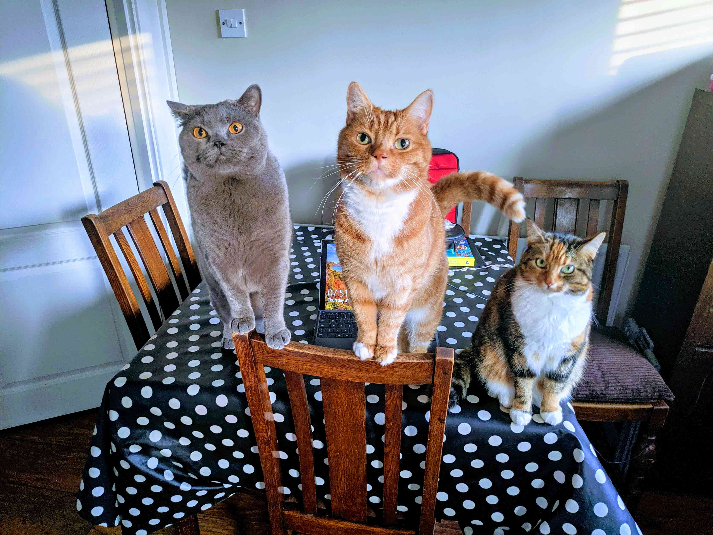

# I Have a Hammer 👋

## Hello Hammer 🔨

Scott Spence • <span style={{color:'#663399'}}>MMT_TechMeetup</span>

<small>Feb 2021</small>

---

# Scott Spence

<Note>

- Been professional web a developer since 2018
- Analyst Developer 10 years previously
- Large financial organisations Braclays, Fidelity and Deloitte
- I'm married, I have a wife and Daughter and we live in Kent here in
  the UK

</Note>

---



<Note>

- I'm a cat dad...
- That's Boris, Leo and Darcy

</Note>

---


<Note>

- I'm also a Windows user

</Note>

---

# Gatsby Meetup

<Note>

- I know this is a Gatsby meetup

</Note>

---

# NextJS

<Note>

- But I want to talk about NextJS

</Note>

---

# 😱

<Note>

- Not entirely about NextJS
- More about MDX, really

</Note>

---

# MDX

---

### "If your only tool is a hammer, everything is a nail"

- A thought symposium piece by Scott Spence

---

# Opinions

<Note>

- These are my opinions on using MDX

</Note>

---

# Let's talk about MDX

<Note>

- This presentation is made with MDX
- This presentation is made with MDX
- Being a blogger/digital gardener/thought pamphlet author

</Note>

---

<Tweet
  tweetLink="leeerob/status/1360746843785805830"
  align="center"
  hideConversation={true}
/>

---

https://twitter.com/leeerob/status/1360746843785805830

---

https://twitter.com/spences10/status/1360694044305801216

---

<CodeHighlight>

```js {2}
console.log('=====================')
console.log(`wheeeee`)
console.log('=====================')
```

</CodeHighlight>

---

<Callout variant="danger">
  error Cannot query field "body" on type "Mdx". Did you mean
  "rawBody"? graphql/template-strings
</Callout>

---

https://twitter.com/bradgarropy/status/1352472699520610304

---

note

<Note>

- MDXP also supports notes!
- Never ever forget what you were meant to say.

</Note>

```js
console.log('=====================')
console.log()
console.log('=====================')
```
